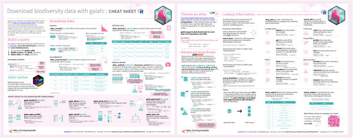

<!-- README.md is generated from README.Rmd. Please edit that file -->

# galah <a href="https://galah.ala.org.au/R/"></a>

<!-- badges: start -->

[](https://cran.r-project.org/package=galah)
[](https://app.codecov.io/gh/AtlasOfLivingAustralia/galah-R?branch=main)
<!-- badges: end -->

## Overview

`galah` is an R interface to biodiversity data hosted by the [Global
Biodiversity Information Facility](https://www.gbif.org) (GBIF) and
those members of the GBIF node network that maintain their own APIs
(i.e. the [‘living atlases’](https://living-atlases.gbif.org)). These
organisations collate and store observations of individual life forms,
using the [‘Darwin Core’](https://dwc.tdwg.org) data standard. `galah`
was built and is maintained by the [Science & Decision Support
Team](https://labs.ala.org.au) at the [Atlas of Living
Australia](https://www.ala.org.au) (ALA).

`galah` enables users to locate and download species occurrence records
(observations, specimens, eDNA records, etc.), taxonomic information, or
associated media such as images or sounds, and to restrict their queries
to particular taxa or locations. Users can specify which columns are
returned by a query, or restrict their results to occurrences that meet
particular data-quality criteria. All functions return a `tibble` as
their standard format.

The package is named for the bird of the same name (*Eolophus
roseicapilla*), a widely-distributed endemic Australian species. The
logo was designed by [Ian Brennan](https://www.iangbrennan.org/).

If you have any comments, questions or suggestions, please [contact
us](mailto:support@ala.org.au).

## Getting started

- The [quick start
  guide](https://galah.ala.org.au/R/articles/quick_start_guide.html)
  provides an introduction to the package functions.
- For an outline of the package structure, and a list of all the
  available functions, run `?galah` or view the [reference
  page](https://galah.ala.org.au/R/index.html).

## Installation

Install from CRAN:

``` r
install.packages("galah")
```

Install the development version from GitHub:

``` r
install.packages("remotes")
remotes::install_github("AtlasOfLivingAustralia/galah-R")
```

`galah` depends on `sf` for location-based searches. To install `galah`
you will need to make sure your system meets the `sf` system
requirements, as specified
[here](https://cran.r-project.org/package=sf).

## Cheat sheet

<a href="https://github.com/AtlasOfLivingAustralia/galah-R/blob/main/cheatsheet/galah-r.pdf"></a>

## Citations

To generate a citation for the package version you are using, you can
run

``` r
citation(package = "galah")
```

If you’re using occurrence data downloaded through `galah` in a
publication, please generate a DOI and cite it. To request a DOI for a
download of occurrence record, set `mint_doi = TRUE` in a call to
`atlas_occurrences()`. To generate a citation for the downloaded
occurrence records, pass the `tibble` generated to `atlas_citation()`.

``` r
# Download occurrence records with a DOI 
occ <- atlas_occurrences(..., mint_doi = TRUE)

# See DOI
attr(occ, "doi")

# Generate citation
atlas_citation(occ)
```
