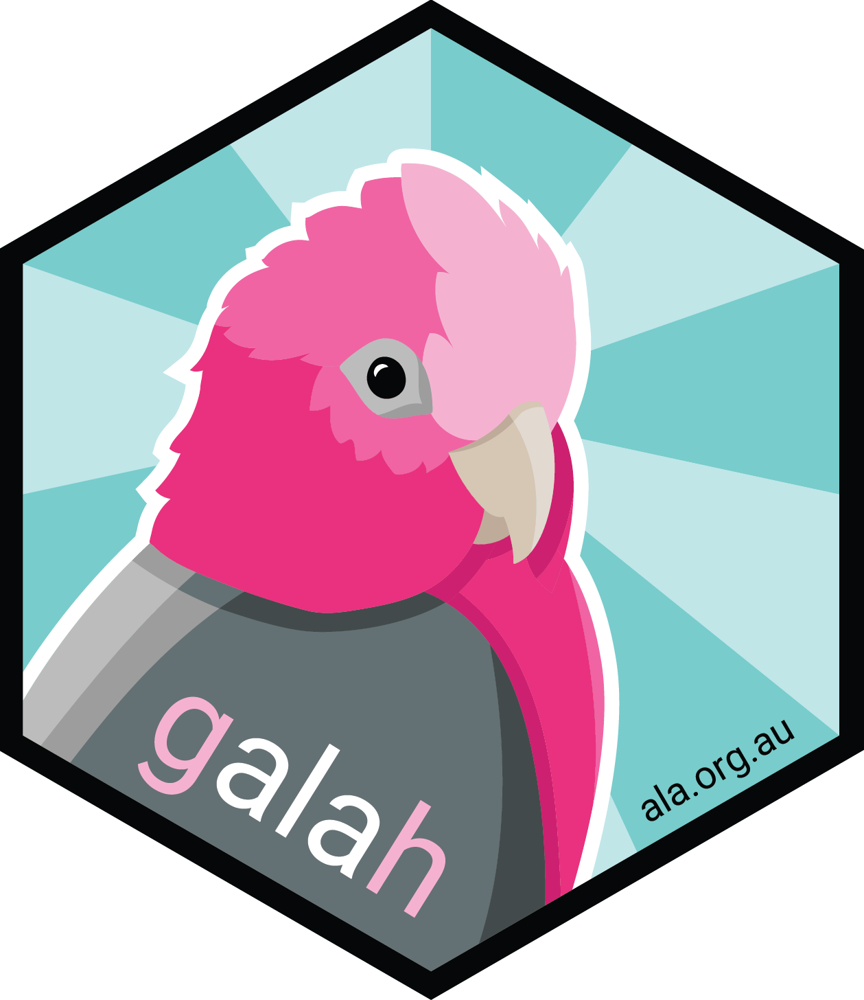

<!-- README.md is generated from README.Rmd. Please edit that file -->


<h2>galah</h2>

[](https://codecov.io/github/AtlasOfLivingAustralia/galah?branch=main)
[](https://CRAN.R-project.org/package=galah)
[](https://cran.r-project.org/package=galah)

---

`galah` is an R interface to biodiversity data hosted by the 'living atlases'; 
a set of organisations that share a common codebase, and act as nodes of the
Global Biodiversity Information Facility ([GBIF](https://www.gbif.org)). These 
organisations collate and store observations of individual life forms, using the 
['Darwin Core'](https://dwc.tdwg.org) data standard. `galah` was built and is 
maintained by the [Science & Decision Support Team](https://labs.ala.org.au) at 
the [Atlas of Living Australia](https://www.ala.org.au) (ALA).

`galah` enables users to locate and download species occurrence records (observations, 
specimens, eDNA records, etc.), taxonomic information, or associated media such 
as images or sounds, and to restrict their queries to particular taxa or
locations. Users can specify which columns are returned by a query, or restrict
their results to occurrences that meet particular data-quality criteria. All 
functions return a `tibble` as their standard format, except
`atlas_taxonomy` which returns tree consisting of `Node` objects using the 
`data.tree` package.

The package is named for the bird of the same name
(*Eolophus roseicapilla*), a widely-distributed endemic Australian species. The 
logo was designed by [Ian Brennan](http://www.iangbrennan.org/).

If you have any comments, questions or suggestions, please [contact us](mailto:support@ala.org.au).

<br>

---

## Getting started

- The [quick start guide](http://galah.ala.org.au/articles/quick_start_guide.html) provides an introduction to the package functions.
- For an outline of the package structure, and a list of all the available functions, run `?galah` or view the [reference page](http://galah.ala.org.au/index.html).

---

## Installation

Install from CRAN:

```r
install.packages("galah")
```

Install the development version from GitHub:

```r
install.packages("remotes")
remotes::install_github("AtlasOfLivingAustralia/galah")
```

On Linux you will first need to ensure that `libcurl` and `v8` (version <= 3.15) are installed on your system --- e.g. on Ubuntu/Debian, open a terminal and do:


```sh
sudo apt-get install libcurl4-openssl-dev libv8-3.14-dev
```

`galah` depends on `sf` for location-based searches. To install `galah` you will
need to make sure your system meets the `sf` system requirements, as specified
[here](https://cran.r-project.org/package=sf)


## Citations
To generate a citation for the package version you are using, you can run
```r
citation(package = "galah")
```
If you're using occurrence data downloaded through `galah` in a publication, please generate a DOI and cite it. 
To request a DOI for a download of occurrence record, set `mint_doi = TRUE` in a call to `atlas_occurrences()`.
To generate a citation for the downloaded occurrence records, pass the `data.frame`
generated to `atlas_citation()`.


```r
# Download occurrence records with a DOI 
occ <- atlas_occurrences(..., mint_doi = TRUE)

# See DOI
attr(occ, "doi")

# Generate citation
atlas_citation(occ)
```
