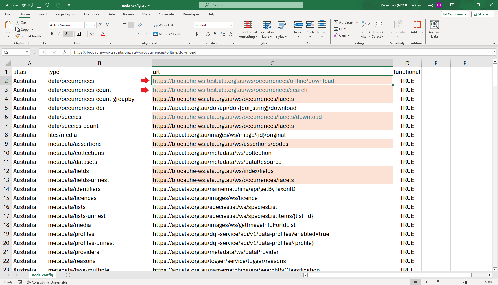

# Testing ALA systems

Occasionally, updates to ALA systems and services (e.g., biocache, logger, bie) will need to be tested within galah to make sure the expected system changes don't break anything in galah. Testing these system changes involves pointing galah's APIs to existing test servers and running galah's test suite to find any noticeable breaks.

Make sure you are on the `main` branch as this is the version of galah that any system updates will immediately affect.

## Setting test server APIs

The first thing to do is point galah at the relevant test server.

For example, the production server for the biocache is https://biocache-ws.ala.org.au/ws/. The test server for the biocache is https://biocache-ws-test.ala.org.au/ws/ or https://api.test.ala.org.au/occurrences/. We will need to update any APIs in galah that use the production server to use the test server instead.

To point galah at the biocache test server, open the `data-raw/node_config.csv`. Any urls with https://biocache-ws.ala.org.au/ws/ should be changed to https://biocache-ws-test.ala.org.au/ws/.

In the image below, the urls that need to be updated are highlighted in orange. The first two urls, highlighted by red arrows, show how to update the url.



## Add updated urls to galah

Once the urls have been updated, the next step is to update this information within galah. galah stores information including APIs internally within `/R/sysdata.rda`. To update the internal data in this file, open `/data-raw/2_internal_data.R`, and run the full script.

## Load galah

galah can now use the updated urls to run queries. Load galah using `Ctl/Cmd` + `Shift` + `L` or by running:

```r
devtools::load_all()
```
## Run tests

Now run all galah tests. 

```r
devtools::test()
```
Keep in mind which types of queries you are expecting to be affected by the test server. This will help you determine whether a failed test is due to the test server or a separate reason. The biocache, for example, can affect queries that return counts (`atlas_counts()`), occurrences(`atlas_occurrences`, `atlas_media()`), media (`request_files()`), fields and assertions (`show_all()`, `search_all()` `galah_filter()`).

If the galah test suite fails early (which often happens if any international atlases are down), run any other relevant test files in `/tests/testthat/` by opening the file and running:

```r
devtools::test_active_file()
```

## Failed tests

If any tests fail, you should investigate what has changed in the test server output that is causing a test to fail. Specific galah tests don't mean anything on their own, and some issues might be due to an overly specific test than an issue with the test server.

It's useful to share the complete query that caused a test to fail. For example, a complete query might look like this.

```r
https://biocache-ws.ala.org.au/ws/occurrences/offline/download?fq=%28lsid%3A%22https%3A%2F%2Fid.biodiversity.org.au%2Ftaxon%2Fapni%2F51268659%22%29AND%28year%3A%222019%22%29&disableAllQualityFilters=true&fields=recordID%2Cmultimedia%2Cimages%2Cvideos%2Csounds&qa=none&facet=false&emailNotify=false&sourceTypeId=2004&reasonTypeId=10&email=ala4r%40ala.org.au&dwcHeaders=true
```

If there is an issue on the data side, it can also be useful to find downloads are cached on your local computer before returning output in the R console (e.g., `atlas_occurrences()`, `atlas_media()`)

## Reverting to production urls

It's important to remove any updates you have made to the `main` branch before finishing systems testing. 

The easiest way to do this if you use GitHub Desktop is to open the `main` branch on GitHub Desktop, select the files you don't wish to keep changes for, right-click --> delete changes.

Alternatively, changes can be reverted manually.

**Happy testing!**
