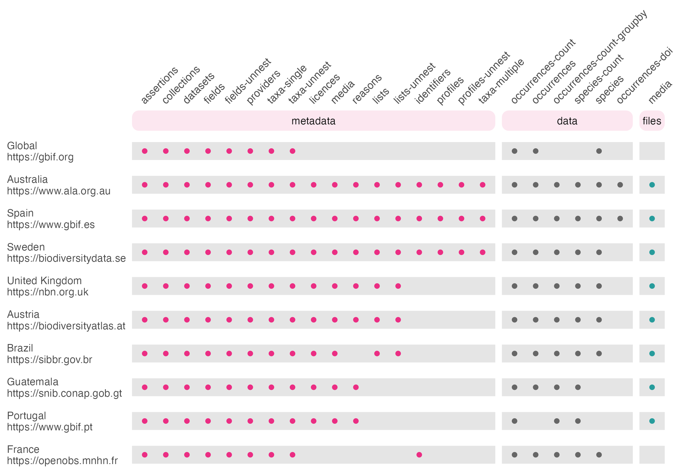

The GBIF network consists of a series of a series of 'node' organisations who
collate biodiversity data from their own countries, with GBIF acting as an 
umbrella organisation to store data from all nodes. Several nodes have their 
own APIs, often built from the 'living atlas' codebase developed by the ALA.
galah enables you to download data either from GBIF (also see `{rgbif}`) or 
from one of 10 node organisations.


```{r, echo = FALSE}
library(reactable)
read.csv("atlas_stats.csv") |>
    reactable(defaultPageSize = 12,
              columns = list(region = colDef("Region", minWidth = 50),
                            institution = colDef("Organisation",
                                                 minWidth = 150),
                            count = colDef("Number of Records", minWidth = 50,
                                           format = colFormat(separators = TRUE)),
                            n_services = colDef("Number of supported APIs", minWidth = 50)))
```

Choosing which node to query is not entirely straightforward. Broadly 
speaking, GBIF is always an easy answer, because it has information from many 
countries. If you only want data from a single country, however, the nodes may 
offer some advantages. Namely, GBIF nodes may support locally-specific:

 - **fields** that can be used for more efficient filtering
 - **taxonomies** that reflect changes not yet adopted by the GBIF taxonomic backbone
 - **services** that are not offered by GBIF such as error checking or large downloads
 
Ultimately, `{galah}` aims to provide _access_ to as many GBIF nodes as possible;
it's up to you which node organisation's data are suitable for your needs! 
galah currently supports the following functions and atlases:

```{r atlas-support, echo = FALSE, out.width = "100%"}

```