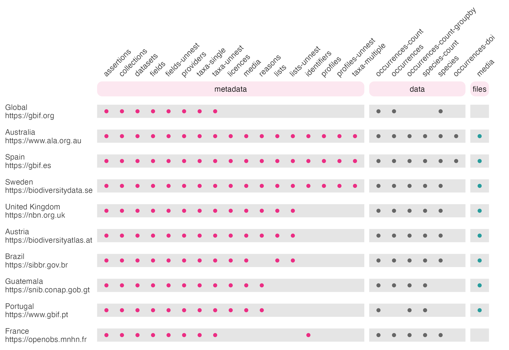

The GBIF network consists of a series of a series of 'node' organisations who
collate biodiversity data from their own countries, with GBIF acting as an 
umbrella organisation to store data from all nodes. Several nodes have their 
own APIs, often built from the 'living atlas' codebase developed by the ALA.
At present, `galah` supports the following functions and atlases:





## Set Organisation

Set which atlas you want to use by changing the `atlas` argument in 
`galah_config()`. The `atlas` argument can accept a full name, an acronym, or a 
region to select a given atlas, all of which are available via `show_all(atlases)`. 
Once a value is provided, it will automatically update `galah`'s server 
configuration to your selected atlas. The default `atlas` is Australia.

If you intend to download records, you may need to register a user profile with 
the relevant atlas first. 


```r
galah_config(atlas = "GBIF.es", email = "your_email_here")
```

## Look up Information

You can use the same look-up functions to find useful information about the 
Atlas you have set. Available information may vary for each Living Atlas.


```r
galah_config(atlas = "Guatemala")
```

```
## Atlas selected: Sistema Nacional de Información sobre Diversidad Biológica de Guatemala (SNIBgt) [Guatemala]
```

```r
show_all(datasets)
```

```
## # A tibble: 100 × 3
##    name                                                                                                                                     uri   uid  
##    <chr>                                                                                                                                    <chr> <chr>
##  1 A Distribution and Taxonomic Reference Dataset of Geranium (Geraniaceae) in the New World                                                http… dr321
##  2 A global database for the distributions of crop wild relatives                                                                           http… dr12 
##  3 A matrix-based revision of the genus Hypogena Dejean, 1834 (Coleoptera Tenebrionidae)                                                    http… dr467
##  4 A new Mexican species of Chrysina Kirby (Coleoptera: Scarabaeidae: Rutelinae), with nomenclatural changes, new records, and a key to th… http… dr554
##  5 A new species of Setostylus Matile and new records of Setostylus bellulus (Williston) (Diptera: Keroplatidae)                            http… dr538
##  6 A revision of the genus Bromeloecia Spuler (Diptera: Sphaeroceridae: Limosininae)                                                        http… dr481
##  7 A synopsis of American Caraphia Gahan, 1906 (Coleoptera: Cerambycidae: Lepturinae) with description of two new species                   http… dr539
##  8 A synopsis of the Neotropical genus Protoneura (Odonata: Coenagrionidae)                                                                 http… dr448
##  9 A systematic revision of the genus Archocentrus (Perciformes: Cichlidae), with the description of two new genera and six new species.    http… dr362
## 10 A taxonomic monograph of the genus Tylodinus Champion (Coleoptera: Curculionidae: Cryptorhynchinae: Tylodina) of Chiapas, Mexico         http… dr564
## # … with 90 more rows
```

```r
show_all(fields)
```

```
## # A tibble: 129 × 4
##    id                   description                                                                                                         type  link 
##    <chr>                <chr>                                                                                                               <chr> <chr>
##  1 all_image_url        Image URLs for this record                                                                                          fiel… <NA> 
##  2 assertion_user_id    User ID of the person who has made an assertion about this record                                                   fiel… <NA> 
##  3 assertions           A list of all assertions (user and system supplied) for a record resulting from data quality tests                  fiel… <NA> 
##  4 assertions_missing   Assertion indicating missing field values for a record. E.g. missing basis of record                                fiel… <NA> 
##  5 assertions_passed    Assertion indicating a data quality test has been passed by this record                                             fiel… <NA> 
##  6 assertions_unchecked Assertion indicating a data quality test was not performed for this record typically due to the absence of fields … fiel… <NA> 
##  7 basis_of_record      The basis of record e.g. Specimen, Observation http://rs.tdwg.org/dwc/terms/basisOfRecord                           fiel… <NA> 
##  8 catalogue_number     http://rs.tdwg.org/dwc/terms/catalogNumber                                                                          fiel… <NA> 
##  9 class                The class the Atlas has matched this record to in the NSL http://rs.tdwg.org/dwc/terms/class                        fiel… <NA> 
## 10 collection_code      The collection code for this record. This will be populated if the data has come from a museum or herbaria http://… fiel… <NA> 
## # … with 119 more rows
```

```r
search_all(fields, "year")
```

```
## # A tibble: 3 × 4
##   id              description                                                                                                              type   link 
##   <chr>           <chr>                                                                                                                    <chr>  <chr>
## 1 year            http://rs.tdwg.org/dwc/terms/year                                                                                        fields <NA> 
## 2 occurrence_year Year ranges for a search. Calculated based on the unique values for a query.                                             fields <NA> 
## 3 date_precision  The precision of the date information for the record. Values include 'Day', 'Month', 'Year', 'Year range', 'Month range' fields <NA>
```

```r
search_taxa("lagomorpha")
```

```
## # A tibble: 1 × 12
##   search_term taxon_concept_id scientific_name scientific_name_authorship rank  kingdom  phylum   class    order      family genus species
##   <chr>       <chr>            <chr>           <chr>                      <chr> <chr>    <chr>    <chr>    <chr>      <chr>  <chr> <chr>  
## 1 lagomorpha  785              Lagomorpha      <NA>                       order Animalia Chordata Mammalia Lagomorpha <NA>   <NA>  <NA>
```

## Download data

You can build queries as you normally would in `galah`. For taxonomic 
queries, use `search_taxa()` to make sure your searches are 
returning the correct taxonomic data.


```r
galah_config(atlas = "United Kingdom")
```

```
## Atlas selected: National Biodiversity Network (NBN) [United Kingdom]
```

```r
search_taxa("vlps")   # Returns no data due to misspelling
```

```
## # A tibble: 1 × 1
##   search_term
##   <chr>      
## 1 vlps
```

```r
search_taxa("vulpes") # Returns data
```

```
## # A tibble: 1 × 13
##   search_term taxon_concept_id scientific_name scientific_name_authorship rank  kingdom  superclass order     class    genus  phylum   family  species
##   <chr>       <chr>            <chr>           <chr>                      <chr> <chr>    <chr>      <chr>     <chr>    <chr>  <chr>    <chr>   <chr>  
## 1 vulpes      NBNSYS0000138878 Vulpes          Frisch, 1775               genus Animalia Tetrapoda  Carnivora Mammalia Vulpes Chordata Canidae <NA>
```

```r
galah_call() |>
  galah_identify("vulpes") |>
  galah_filter(year > 2010) |>
  atlas_counts()
```

```
## # A tibble: 1 × 1
##   count
##   <int>
## 1 98760
```

Download species occurrence records from other atlases with 
`atlas_occurrences()`


```r
galah_config(atlas = "Guatemala")
```

```
## Atlas selected: Sistema Nacional de Información sobre Diversidad Biológica de Guatemala (SNIBgt) [Guatemala]
```

```r
galah_call() |>
  galah_identify("Lagomorpha") |>
  galah_filter(year <= 1980) |>
  galah_select(taxon_name, year) |>
  atlas_occurrences()
```

```
## # A tibble: 39 × 2
##    scientificName                                         year
##    <chr>                                                 <dbl>
##  1 Sylvilagus floridanus (J. A. Allen, 1890)              1960
##  2 Sylvilagus brasiliensis subsp. truei (J. Allen, 1890)  1960
##  3 Sylvilagus floridanus (J. A. Allen, 1890)              1952
##  4 Sylvilagus floridanus (J. A. Allen, 1890)              1955
##  5 Sylvilagus floridanus (J. A. Allen, 1890)              1955
##  6 Sylvilagus floridanus (J. A. Allen, 1890)              1968
##  7 Sylvilagus brasiliensis subsp. truei (J. Allen, 1890)  1947
##  8 Sylvilagus floridanus (J. A. Allen, 1890)              1968
##  9 Sylvilagus floridanus (J. A. Allen, 1890)              1968
## 10 Sylvilagus floridanus subsp. aztecus (J. Allen, 1890)  1895
## # … with 29 more rows
```


# Complex queries with multiple Atlases

It is also possible to create more complex queries that return data from 
multiple Living Atlases. As an example, setting atlases within a loop with 
`galah_config()` and `purrr::map()` allows us to return the total number of 
species records in each Living Atlas in one table.


```r
library(purrr)
library(tibble)
library(dplyr)
library(gt)

atlases <- show_all(atlases)

counts <- map(atlases$region, 
  function(x){
    galah_config(atlas = x)
    atlas_counts()
})

tibble(
  atlas = atlases$region, 
  n = unlist(counts)) |> 
  filter(n > 0) |>
  arrange(desc(n)) |>
  gt() |>
  fmt_number(column = n)
```

<!--html_preserve--><div id="ngacdzitmc" style="padding-left:0px;padding-right:0px;padding-top:10px;padding-bottom:10px;overflow-x:auto;overflow-y:auto;width:auto;height:auto;">
<style>html {
  font-family: -apple-system, BlinkMacSystemFont, 'Segoe UI', Roboto, Oxygen, Ubuntu, Cantarell, 'Helvetica Neue', 'Fira Sans', 'Droid Sans', Arial, sans-serif;
}

#ngacdzitmc .gt_table {
  display: table;
  border-collapse: collapse;
  margin-left: auto;
  margin-right: auto;
  color: #333333;
  font-size: 16px;
  font-weight: normal;
  font-style: normal;
  background-color: #FFFFFF;
  width: auto;
  border-top-style: solid;
  border-top-width: 2px;
  border-top-color: #A8A8A8;
  border-right-style: none;
  border-right-width: 2px;
  border-right-color: #D3D3D3;
  border-bottom-style: solid;
  border-bottom-width: 2px;
  border-bottom-color: #A8A8A8;
  border-left-style: none;
  border-left-width: 2px;
  border-left-color: #D3D3D3;
}

#ngacdzitmc .gt_heading {
  background-color: #FFFFFF;
  text-align: center;
  border-bottom-color: #FFFFFF;
  border-left-style: none;
  border-left-width: 1px;
  border-left-color: #D3D3D3;
  border-right-style: none;
  border-right-width: 1px;
  border-right-color: #D3D3D3;
}

#ngacdzitmc .gt_caption {
  padding-top: 4px;
  padding-bottom: 4px;
}

#ngacdzitmc .gt_title {
  color: #333333;
  font-size: 125%;
  font-weight: initial;
  padding-top: 4px;
  padding-bottom: 4px;
  padding-left: 5px;
  padding-right: 5px;
  border-bottom-color: #FFFFFF;
  border-bottom-width: 0;
}

#ngacdzitmc .gt_subtitle {
  color: #333333;
  font-size: 85%;
  font-weight: initial;
  padding-top: 0;
  padding-bottom: 6px;
  padding-left: 5px;
  padding-right: 5px;
  border-top-color: #FFFFFF;
  border-top-width: 0;
}

#ngacdzitmc .gt_bottom_border {
  border-bottom-style: solid;
  border-bottom-width: 2px;
  border-bottom-color: #D3D3D3;
}

#ngacdzitmc .gt_col_headings {
  border-top-style: solid;
  border-top-width: 2px;
  border-top-color: #D3D3D3;
  border-bottom-style: solid;
  border-bottom-width: 2px;
  border-bottom-color: #D3D3D3;
  border-left-style: none;
  border-left-width: 1px;
  border-left-color: #D3D3D3;
  border-right-style: none;
  border-right-width: 1px;
  border-right-color: #D3D3D3;
}

#ngacdzitmc .gt_col_heading {
  color: #333333;
  background-color: #FFFFFF;
  font-size: 100%;
  font-weight: normal;
  text-transform: inherit;
  border-left-style: none;
  border-left-width: 1px;
  border-left-color: #D3D3D3;
  border-right-style: none;
  border-right-width: 1px;
  border-right-color: #D3D3D3;
  vertical-align: bottom;
  padding-top: 5px;
  padding-bottom: 6px;
  padding-left: 5px;
  padding-right: 5px;
  overflow-x: hidden;
}

#ngacdzitmc .gt_column_spanner_outer {
  color: #333333;
  background-color: #FFFFFF;
  font-size: 100%;
  font-weight: normal;
  text-transform: inherit;
  padding-top: 0;
  padding-bottom: 0;
  padding-left: 4px;
  padding-right: 4px;
}

#ngacdzitmc .gt_column_spanner_outer:first-child {
  padding-left: 0;
}

#ngacdzitmc .gt_column_spanner_outer:last-child {
  padding-right: 0;
}

#ngacdzitmc .gt_column_spanner {
  border-bottom-style: solid;
  border-bottom-width: 2px;
  border-bottom-color: #D3D3D3;
  vertical-align: bottom;
  padding-top: 5px;
  padding-bottom: 5px;
  overflow-x: hidden;
  display: inline-block;
  width: 100%;
}

#ngacdzitmc .gt_group_heading {
  padding-top: 8px;
  padding-bottom: 8px;
  padding-left: 5px;
  padding-right: 5px;
  color: #333333;
  background-color: #FFFFFF;
  font-size: 100%;
  font-weight: initial;
  text-transform: inherit;
  border-top-style: solid;
  border-top-width: 2px;
  border-top-color: #D3D3D3;
  border-bottom-style: solid;
  border-bottom-width: 2px;
  border-bottom-color: #D3D3D3;
  border-left-style: none;
  border-left-width: 1px;
  border-left-color: #D3D3D3;
  border-right-style: none;
  border-right-width: 1px;
  border-right-color: #D3D3D3;
  vertical-align: middle;
  text-align: left;
}

#ngacdzitmc .gt_empty_group_heading {
  padding: 0.5px;
  color: #333333;
  background-color: #FFFFFF;
  font-size: 100%;
  font-weight: initial;
  border-top-style: solid;
  border-top-width: 2px;
  border-top-color: #D3D3D3;
  border-bottom-style: solid;
  border-bottom-width: 2px;
  border-bottom-color: #D3D3D3;
  vertical-align: middle;
}

#ngacdzitmc .gt_from_md > :first-child {
  margin-top: 0;
}

#ngacdzitmc .gt_from_md > :last-child {
  margin-bottom: 0;
}

#ngacdzitmc .gt_row {
  padding-top: 8px;
  padding-bottom: 8px;
  padding-left: 5px;
  padding-right: 5px;
  margin: 10px;
  border-top-style: solid;
  border-top-width: 1px;
  border-top-color: #D3D3D3;
  border-left-style: none;
  border-left-width: 1px;
  border-left-color: #D3D3D3;
  border-right-style: none;
  border-right-width: 1px;
  border-right-color: #D3D3D3;
  vertical-align: middle;
  overflow-x: hidden;
}

#ngacdzitmc .gt_stub {
  color: #333333;
  background-color: #FFFFFF;
  font-size: 100%;
  font-weight: initial;
  text-transform: inherit;
  border-right-style: solid;
  border-right-width: 2px;
  border-right-color: #D3D3D3;
  padding-left: 5px;
  padding-right: 5px;
}

#ngacdzitmc .gt_stub_row_group {
  color: #333333;
  background-color: #FFFFFF;
  font-size: 100%;
  font-weight: initial;
  text-transform: inherit;
  border-right-style: solid;
  border-right-width: 2px;
  border-right-color: #D3D3D3;
  padding-left: 5px;
  padding-right: 5px;
  vertical-align: top;
}

#ngacdzitmc .gt_row_group_first td {
  border-top-width: 2px;
}

#ngacdzitmc .gt_summary_row {
  color: #333333;
  background-color: #FFFFFF;
  text-transform: inherit;
  padding-top: 8px;
  padding-bottom: 8px;
  padding-left: 5px;
  padding-right: 5px;
}

#ngacdzitmc .gt_first_summary_row {
  border-top-style: solid;
  border-top-color: #D3D3D3;
}

#ngacdzitmc .gt_first_summary_row.thick {
  border-top-width: 2px;
}

#ngacdzitmc .gt_last_summary_row {
  padding-top: 8px;
  padding-bottom: 8px;
  padding-left: 5px;
  padding-right: 5px;
  border-bottom-style: solid;
  border-bottom-width: 2px;
  border-bottom-color: #D3D3D3;
}

#ngacdzitmc .gt_grand_summary_row {
  color: #333333;
  background-color: #FFFFFF;
  text-transform: inherit;
  padding-top: 8px;
  padding-bottom: 8px;
  padding-left: 5px;
  padding-right: 5px;
}

#ngacdzitmc .gt_first_grand_summary_row {
  padding-top: 8px;
  padding-bottom: 8px;
  padding-left: 5px;
  padding-right: 5px;
  border-top-style: double;
  border-top-width: 6px;
  border-top-color: #D3D3D3;
}

#ngacdzitmc .gt_striped {
  background-color: rgba(128, 128, 128, 0.05);
}

#ngacdzitmc .gt_table_body {
  border-top-style: solid;
  border-top-width: 2px;
  border-top-color: #D3D3D3;
  border-bottom-style: solid;
  border-bottom-width: 2px;
  border-bottom-color: #D3D3D3;
}

#ngacdzitmc .gt_footnotes {
  color: #333333;
  background-color: #FFFFFF;
  border-bottom-style: none;
  border-bottom-width: 2px;
  border-bottom-color: #D3D3D3;
  border-left-style: none;
  border-left-width: 2px;
  border-left-color: #D3D3D3;
  border-right-style: none;
  border-right-width: 2px;
  border-right-color: #D3D3D3;
}

#ngacdzitmc .gt_footnote {
  margin: 0px;
  font-size: 90%;
  padding-left: 4px;
  padding-right: 4px;
  padding-left: 5px;
  padding-right: 5px;
}

#ngacdzitmc .gt_sourcenotes {
  color: #333333;
  background-color: #FFFFFF;
  border-bottom-style: none;
  border-bottom-width: 2px;
  border-bottom-color: #D3D3D3;
  border-left-style: none;
  border-left-width: 2px;
  border-left-color: #D3D3D3;
  border-right-style: none;
  border-right-width: 2px;
  border-right-color: #D3D3D3;
}

#ngacdzitmc .gt_sourcenote {
  font-size: 90%;
  padding-top: 4px;
  padding-bottom: 4px;
  padding-left: 5px;
  padding-right: 5px;
}

#ngacdzitmc .gt_left {
  text-align: left;
}

#ngacdzitmc .gt_center {
  text-align: center;
}

#ngacdzitmc .gt_right {
  text-align: right;
  font-variant-numeric: tabular-nums;
}

#ngacdzitmc .gt_font_normal {
  font-weight: normal;
}

#ngacdzitmc .gt_font_bold {
  font-weight: bold;
}

#ngacdzitmc .gt_font_italic {
  font-style: italic;
}

#ngacdzitmc .gt_super {
  font-size: 65%;
}

#ngacdzitmc .gt_footnote_marks {
  font-style: italic;
  font-weight: normal;
  font-size: 75%;
  vertical-align: 0.4em;
}

#ngacdzitmc .gt_asterisk {
  font-size: 100%;
  vertical-align: 0;
}

#ngacdzitmc .gt_indent_1 {
  text-indent: 5px;
}

#ngacdzitmc .gt_indent_2 {
  text-indent: 10px;
}

#ngacdzitmc .gt_indent_3 {
  text-indent: 15px;
}

#ngacdzitmc .gt_indent_4 {
  text-indent: 20px;
}

#ngacdzitmc .gt_indent_5 {
  text-indent: 25px;
}
</style>
<table class="gt_table">
  
  <thead class="gt_col_headings">
    <tr>
      <th class="gt_col_heading gt_columns_bottom_border gt_left" rowspan="1" colspan="1" scope="col" id="atlas">atlas</th>
      <th class="gt_col_heading gt_columns_bottom_border gt_right" rowspan="1" colspan="1" scope="col" id="n">n</th>
    </tr>
  </thead>
  <tbody class="gt_table_body">
    <tr><td headers="atlas" class="gt_row gt_left">Global</td>
<td headers="n" class="gt_row gt_right">1,814,565,214.00</td></tr>
    <tr><td headers="atlas" class="gt_row gt_left">United Kingdom</td>
<td headers="n" class="gt_row gt_right">208,111,761.00</td></tr>
    <tr><td headers="atlas" class="gt_row gt_left">France</td>
<td headers="n" class="gt_row gt_right">128,490,040.00</td></tr>
    <tr><td headers="atlas" class="gt_row gt_left">Australia</td>
<td headers="n" class="gt_row gt_right">114,091,351.00</td></tr>
    <tr><td headers="atlas" class="gt_row gt_left">Sweden</td>
<td headers="n" class="gt_row gt_right">103,417,222.00</td></tr>
    <tr><td headers="atlas" class="gt_row gt_left">Spain</td>
<td headers="n" class="gt_row gt_right">38,330,113.00</td></tr>
    <tr><td headers="atlas" class="gt_row gt_left">Brazil</td>
<td headers="n" class="gt_row gt_right">24,139,042.00</td></tr>
    <tr><td headers="atlas" class="gt_row gt_left">Portugal</td>
<td headers="n" class="gt_row gt_right">16,043,865.00</td></tr>
    <tr><td headers="atlas" class="gt_row gt_left">Austria</td>
<td headers="n" class="gt_row gt_right">8,075,385.00</td></tr>
    <tr><td headers="atlas" class="gt_row gt_left">Estonia</td>
<td headers="n" class="gt_row gt_right">7,163,505.00</td></tr>
    <tr><td headers="atlas" class="gt_row gt_left">Guatemala</td>
<td headers="n" class="gt_row gt_right">3,586,634.00</td></tr>
  </tbody>
  
  
</table>
</div><!--/html_preserve-->

