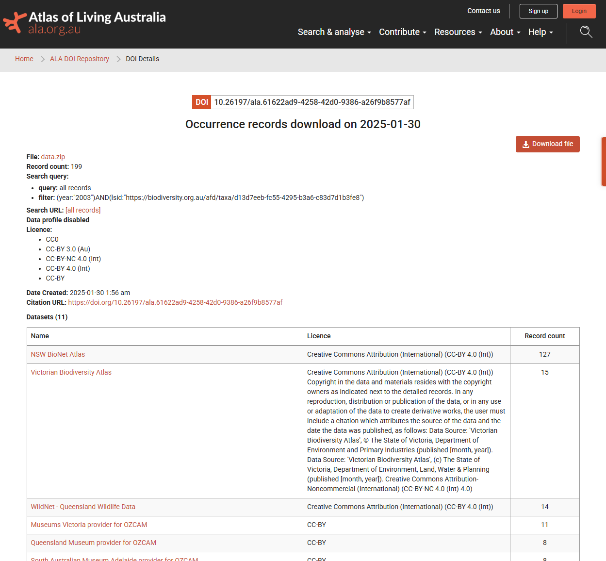

Reproducible data downloads are important for a project's long-term use
and longevity. Below we briefly discuss why galah queries aren't
reproducible by default, how to make a data download reproducible, and
how to download the same data again in future.

## The trade-off of new data

By default, galah downloads data directly from each Living Atlas API.
This default means that galah automatically downloads the most
up-to-date data available (yay!).

Living Atlases, however, are constantly ingesting more data. These new
data may be from within the last week, the last year, or the last
hundred years, depending on the source. As a result, even if we run the 
same query, the data we download today may return a different result from 
the data we downloaded yesterday! Frequent data ingestion means that 
although galah is useful because it downloads the latest data, galah 
won't necessarily return the same data every time we run the same query. 
How can we preserve the result returned by a query if the query always 
changes?

We recommend you take two steps to ensure your data are stable:

- download data to a specified location so you can find and re-use it later
- request a DOI with your download so you can request it again if needed (and cite it correctly!)

These steps are independent, so you can choose whether to enact 
none, one, or both of them in the same workflow. We will show you how to do 
both.

## Generate a data DOI

To make data downloads reproducible, galah allows us to mint a unique
*DOI* (Digital Object Identifier) for a specific query and its
subsequent result.

A DOI works very similarly to a url, in that it holds content that is
accessed using a specific link. However, a url can "break" if the url is
renamed or the content once found under a certain url is moved to a new
url. In contrast, a DOI is persistent and will always direct a user to
the same content, even if the url changes. This persistence is why DOIs
are valuable for long-term reproducibility of content.

In galah, you can also add a DOI to your download query. You just need
to add `mint_doi = TRUE` to `atlas_occurrences()`. A unique DOI will be
assigned to the resulting object once the query is run.

Please note that DOI generation and reload is currently supported only for 
queries to the Atlas of Living Australia. GBIF provides a DOI with every 
download, but at the time of writing, they don't provide an API to use 
that DOI to download the dataset a second time. Other atlases don't support 
DOIs at all (yet).


``` r
library(galah)
galah_config(email = "your-email-here",
             directory = "ALA_downloads")

# download bandicoot occurrence records from 2003
occs <- galah_call() |>
  identify("perameles") |>
  filter(year == 2003) |>
  atlas_occurrences(mint_doi = TRUE,                  # add DOI
                    file = "bandicoots_2003_data.zip" # specify filename
                    )

occs |> print(n = 5)
```


```
## # A tibble: 201 × 8
##   recordID    scientificName taxonConceptID decimalLatitude decimalLongitude
##   <chr>       <chr>          <chr>                    <dbl>            <dbl>
## 1 00300a96-e… Perameles nas… https://biodi…           -33.7             151.
## 2 0134472a-2… Perameles nas… https://biodi…           -34.7             151.
## 3 01e7b99e-9… Perameles gun… https://biodi…           -42.9             147.
## 4 029c49f0-b… Perameles nas… https://biodi…           -35.1             151.
## 5 0345dbe1-9… Perameles nas… https://biodi…           -35.5             150.
## # ℹ 196 more rows
## # ℹ 3 more variables: eventDate <dttm>, occurrenceStatus <chr>,
## #   dataResourceName <chr>
```

galah preserves lots of information in an object's attributes, many
which are used to construct the API query sent to the specified Living
Atlas. We can view the new DOI assigned to `occs` by checking its
attributes.


``` r
attributes(occs)$doi
```

```
## [1] "https://doi.org/10.26197/ala.7605ea98-e90f-46d4-998c-1b6673c48d34"
```

We can also view information on how to cite this dataset:


``` r
atlas_citation(occs)
```

```
## The citation for this dataset is:
## 
## Atlas of Living Australia (7 February 2025) Occurrence download
## https://doi.org/10.26197/ala.7605ea98-e90f-46d4-998c-1b6673c48d34
## 
## Please consider citing R & galah, in addition to your dataset:
## 
## R Core Team (2024). _R: A Language and Environment for Statistical
## Computing_. R Foundation for Statistical Computing, Vienna, Austria.
## <https://www.R-project.org/>.
## 
## Westgate M, Kellie D, Stevenson M & Newman P (2025): _galah: Biodiversity
## Data from the GBIF Node Network_. R package version 2.1.1. doi:
## 10.32614/CRAN.package.galah
```

If you need to reload this data locally, you can do that by simply calling
`read_zip()`:


``` r
read_zip("./ALA_downloads/bandicoots_2003_data.zip") |>
  print(n = 5)
```

```
## # A tibble: 201 × 8
##   recordID    scientificName taxonConceptID decimalLatitude decimalLongitude
##   <chr>       <chr>          <chr>                    <dbl>            <dbl>
## 1 00300a96-e… Perameles nas… https://biodi…           -33.7             151.
## 2 0134472a-2… Perameles nas… https://biodi…           -34.7             151.
## 3 01e7b99e-9… Perameles gun… https://biodi…           -42.9             147.
## 4 029c49f0-b… Perameles nas… https://biodi…           -35.1             151.
## 5 0345dbe1-9… Perameles nas… https://biodi…           -35.5             150.
## # ℹ 196 more rows
## # ℹ 3 more variables: eventDate <dttm>, occurrenceStatus <chr>,
## #   dataResourceName <chr>
```

More importantly, though, we now have a persistent link to this data download. 
If we paste this DOI into your browser, we can see additional information about 
our query, including a breakdown of data providers and licensing.

<div class="figure">

<p class="caption">plot of chunk atlas-support</p>
</div>

## Download data using a DOI

To use a DOI to return the results of a query again, we'll use
`galah_filter()`. We can specify that we would like to filter our
results to only the records returned by our DOI.


``` r
occs_again <- galah_call() |>
  filter(doi == attributes(occs)$doi) |> # filter by doi
  atlas_occurrences()

occs_again |> print(n = 5)
```

```
## # A tibble: 201 × 8
##   recordID    scientificName taxonConceptID decimalLatitude decimalLongitude
##   <chr>       <chr>          <chr>                    <dbl>            <dbl>
## 1 00300a96-e… Perameles nas… https://biodi…           -33.7             151.
## 2 0134472a-2… Perameles nas… https://biodi…           -34.7             151.
## 3 01e7b99e-9… Perameles gun… https://biodi…           -42.9             147.
## 4 029c49f0-b… Perameles nas… https://biodi…           -35.1             151.
## 5 0345dbe1-9… Perameles nas… https://biodi…           -35.5             150.
## # ℹ 196 more rows
## # ℹ 3 more variables: eventDate <dttm>, occurrenceStatus <chr>,
## #   dataResourceName <chr>
```

Our query reproduces the the same records as our original query!

If you would like other examples, we use this DOI method to
reproducibly download data throughout the [*Cleaning Biodiversity Data in R*](https://cleaning-data-r.ala.org.au/data-in-this-book.html) book.


