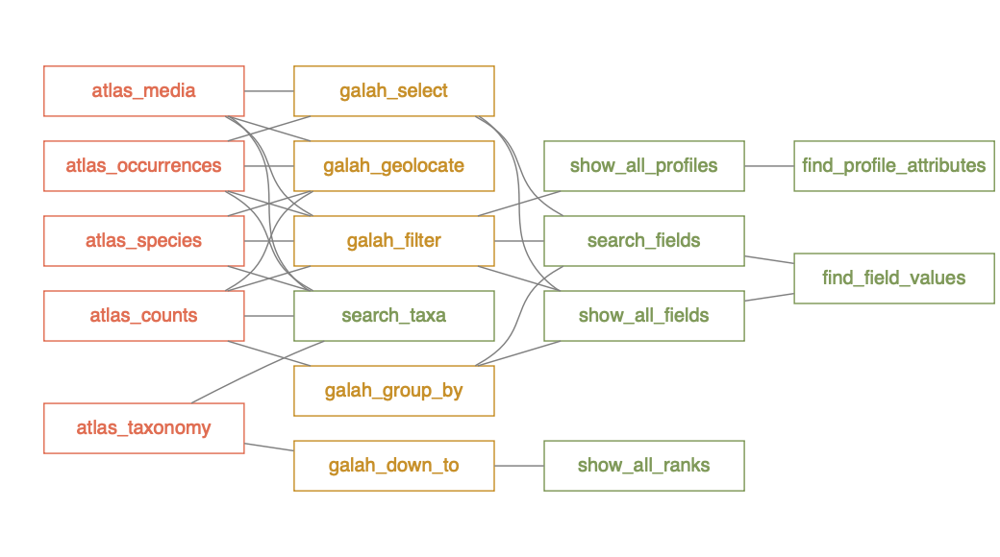

# About
`galah` is an R interface to biodiversity data hosted by the 
[Atlas of Living Australia](https://ala.org.au) (ALA). The ALA is a repository 
of biodiversity data, focussed primarily on observations of individual life forms. 
Like the Global Biodiversity Information Facility ([GBIF](https://www.gbif.org)), 
the basic unit of data at ALA is an **occurrence** record, based on the 
['Darwin Core'](https://dwc.tdwg.org) data standard.

`galah` enables users to locate and download species observations, taxonomic
information, record counts, or associated media such as images or sounds. Users 
can restrict their queries to particular taxa or locations by specifying which 
columns and rows are returned by a query, or by restricting their results to 
observations that meet particular quality-control criteria. With a few minor
exceptions, all functions return a `tibble` as their standard format.


# Installation
To install from CRAN:

```r
install.packages("galah")
```

Or install the development version from GitHub:

```r
install.packages("remotes")
remotes::install_github("AtlasOfLivingAustralia/galah")
```

Load the package

```r
library(galah)
```

# Choosing an atlas
By default, `galah` downloads information from the Atlas of Living Australia (ALA).
To show the full list of Atlases currently supported by `galah`, use 
`show_all_atlases()`.


```r
show_all_atlases()
```

```
## # A tibble: 6 × 3
##   atlas     taxonomy_source taxonomy_info                                                    
##   <chr>     <chr>           <chr>                                                            
## 1 Australia ALA             https://bie.ala.org.au/                                          
## 2 Austria   GBIF            https://www.gbif.org/dataset/d7dddbf4-2cf0-4f39-9b2a-bb099caae36c
## 3 Guatemala GBIF            https://www.gbif.org/dataset/d7dddbf4-2cf0-4f39-9b2a-bb099caae36c
## 4 Spain     GBIF            https://www.gbif.org/dataset/d7dddbf4-2cf0-4f39-9b2a-bb099caae36c
## 5 Sweden    GBIF            https://www.gbif.org/dataset/d7dddbf4-2cf0-4f39-9b2a-bb099caae36c
## 6 UK        NBN             https://www.nhm.ac.uk/our-science/data/uk-species.html
```

Use `galah_config()` to set the Atlas to use. This will automatically populate the 
server configuration for your selected Atlas. By default, the atlas is Australia.


```r
galah_config(atlas = "UK")
```

# Building queries
Functions that return data from the chosen atlas have the prefix `atlas_`; e.g.
to find the total number of records in the atlas, use:
  

```r
atlas_counts()
```

```
## # A tibble: 1 × 1
##       count
##       <int>
## 1 102070026
```

To pass more complex queries, start with the `galah_call()` function and pipe
additional arguments to modify the query. modifying functions have a `galah_`
prefix and support non-standard evaluation (NSE).


```r
galah_call() |> 
  galah_filter(year >= 2020) |> 
  atlas_counts()
```

```
## # A tibble: 1 × 1
##     count
##     <int>
## 1 7046687
```

To narrow the search to a particular taxonomic group, use `galah_identify()`. Note
that this function only accepts scientific names and is not case sensitive. It's 
good practice to first use `search_taxa()` to check that the taxa you provide 
returns the correct taxonomic results.


```r
search_taxa("reptilia") # Check whether taxonomic info is correct
```

```
## # A tibble: 1 × 9
##   search_term scientific_name taxon_concept_id                                    rank  match_type kingdom  phylum   class  issues
##   <chr>       <chr>           <chr>                                               <chr> <chr>      <chr>    <chr>    <chr>  <chr> 
## 1 reptilia    REPTILIA        urn:lsid:biodiversity.org.au:afd.taxon:682e1228-5b… class exactMatch Animalia Chordata Repti… noIss…
```

```r
galah_call() |>
  galah_filter(year >= 2020) |> 
  galah_identify("reptilia") |> 
  atlas_counts()
```

```
## # A tibble: 1 × 1
##   count
##   <int>
## 1 45020
```

# Downloading records
The most common use case for `galah` is to download 'occurrence' records; 
observations of plants or animals made by contributors to the atlas. To download,
first register with the relevant atlas, then provide your registration email. 


```r
galah_config(email = "email@email.com")
```


Then you can customise records you require and query the atlas in question:

```r
result <- galah_call() |>
  galah_identify("Litoria") |>
  galah_filter(year >= 2020, cl22 == "Tasmania") |>
  galah_select(basisOfRecord, group = "basic") |>
  atlas_occurrences()

result |> head()
```

```
## # A tibble: 6 × 8
##   decimalLatitude decimalLongitude eventDate              scientificName  taxonConceptID   recordID dataResourceName basisOfRecord
##             <dbl>            <dbl> <chr>                  <chr>           <chr>            <chr>    <chr>            <chr>        
## 1           -43.4             147. ""                     Litoria ewingii urn:lsid:biodiv… 780cf8e… iNaturalist Aus… HUMAN_OBSERV…
## 2           -43.2             147. "2020-01-18T22:31:00Z" Litoria ewingii urn:lsid:biodiv… cc9d437… iNaturalist Aus… HUMAN_OBSERV…
## 3           -43.2             147. ""                     Litoria ewingii urn:lsid:biodiv… d208d47… iNaturalist Aus… HUMAN_OBSERV…
## 4           -43.1             147. ""                     Litoria ewingii urn:lsid:biodiv… 95fab19… iNaturalist Aus… HUMAN_OBSERV…
## 5           -43.1             147. "2020-04-30T06:10:00Z" Litoria ewingii urn:lsid:biodiv… 2b7fdc5… Earth Guardians… HUMAN_OBSERV…
## 6           -43.1             147. "2020-06-23T02:48:00Z" Litoria ewingii urn:lsid:biodiv… 3524080… Earth Guardians… HUMAN_OBSERV…
```

Check out our other vignettes for more detail on how to use these functions.

# Function map
Not all `atlas_` functions support all possible query modifiers (i.e. functions
with a `search_` or `galah_` prefix). A network diagram showing accepted arguments
is shown below. Note that if you pipe your queries starting with `galah_call()`,
then irrelevant arguments will be (silently) ignored. 




