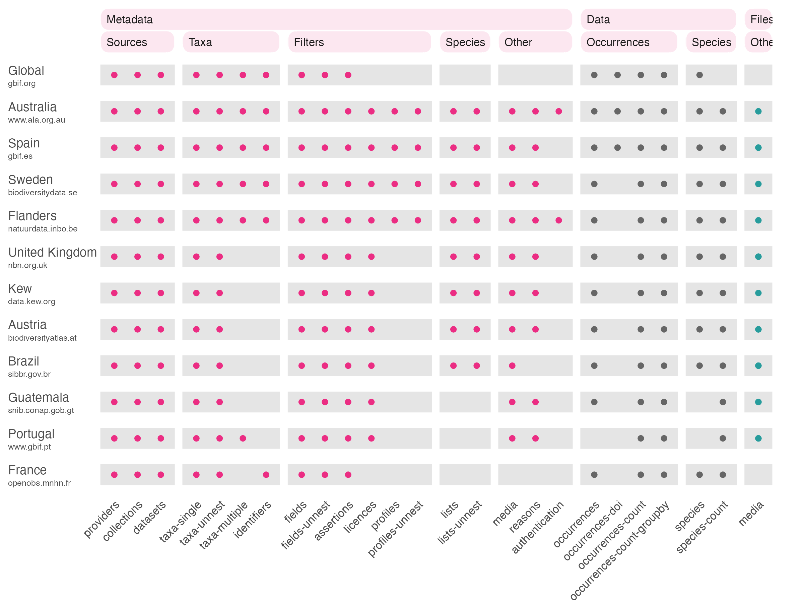

`galah` is an R interface to biodiversity data hosted by the Global Biodiversity 
Information Facility ([GBIF](https://www.gbif.org)) and its subsidiary node
organisations. GBIF and its partner nodes collate and store observations of 
individual life forms using the ['Darwin Core'](https://dwc.tdwg.org) data 
standard.

# Installation

To install from CRAN:

``` r
install.packages("galah")
```

Or install the development version from GitHub:

``` r
install.packages("remotes")
remotes::install_github("AtlasOfLivingAustralia/galah")
```

Load the package

``` r
library(galah)
```

# Getting data

`galah` is a `dplyr` extension package; rather than using pipes to amend 
a `tibble` in your workspace, you amend a query, which is then sent to your
chosen organisation. These pipes differ from traditional syntax in two ways:

- they begin with a function - usually `request_data()` - instead of a `tibble`
- they end with one of `dplyr`'s evaluation functions, usually `collect()`

So an example query might be to find the number of records:


``` r
request_data() |>    # open a pipe
  count() |>       # count the number of rows
  collect()        # retrieve query from the server
```

```
## # A tibble: 1 × 1
##       count
##       <int>
## 1 179728084
```

By default, queries are sent to the Atlas of Living Australia, but this can
be changed using the `from` argument:


``` r
request_data(from = "Sweden") |>
  count() |>
  collect()
```

```
## # A tibble: 1 × 1
##       count
##       <int>
## 1 173135256
```

The `from` argument accepts the `acronym`, `region`, or `institution` fields from 
`show_all(atlases)`. The full list of supported queries by organisation is as follows:

<div class="figure">

<p class="caption">Figure 1: Organisations (rows) and APIs (columns) supported by galah</p>
</div>

# Filtering

You can pass taxonomic filters to your query with `identify()`:


``` r
request_data() |>
  identify("Eolophus roseicapilla") |>
  count() |>
  collect()
```

```
## # A tibble: 1 × 1
##     count
##     <int>
## 1 1594059
```

To choose records using non-taxonomic criteria, you'll need to use `filter()`.
This reqires that you find out:

- what **fields** (columns) are present in the dataset you are searching
- what **values** exist for those fields

You can answer the first question with `describe()`:


``` r
request_data() |>
  describe() |>
  collect()
```

```
## # A tibble: 581 × 3
##    id                    description               data_type
##    <chr>                 <chr>                     <chr>    
##  1 acceptedNameUsage     Accepted name             string   
##  2 acceptedNameUsageID   Accepted name             string   
##  3 accessRights          Access rights             string   
##  4 annotationsDoi        <NA>                      string   
##  5 annotationsUid        Referenced by publication string   
##  6 assertionUserId       Assertions by user        string   
##  7 assertions            Record issues             string   
##  8 assertionsCount       <NA>                      int      
##  9 associatedMedia       Associated Media          string   
## 10 associatedOccurrences Associated Occurrences    string   
## # ℹ 571 more rows
```

Once you find a variable you are interested in, see what values it contains
using `distinct()`:


``` r
request_data() |>
  distinct(basisOfRecord) |>
  collect()
```

```
## # A tibble: 9 × 1
##   basisOfRecord      
##   <chr>              
## 1 HUMAN_OBSERVATION  
## 2 PRESERVED_SPECIMEN 
## 3 OCCURRENCE         
## 4 MACHINE_OBSERVATION
## 5 OBSERVATION        
## 6 MATERIAL_SAMPLE    
## 7 LIVING_SPECIMEN    
## 8 FOSSIL_SPECIMEN    
## 9 MATERIAL_CITATION
```

Then you can combine these within a `filter()` query:


``` r
request_data() |>
  filter(basisOfRecord == "PRESERVED_SPECIMEN") |>
  count() |> 
  collect()
```

```
## # A tibble: 1 × 1
##      count
##      <int>
## 1 18189911
```

These functions can be combined in a number of ways, for example to
learn how many species are present within the genus 'Crinia':


``` r
request_data() |>
  identify("Crinia") |>   # filters by taxonomic names
  distinct(speciesID) |>  # keep only unique values
  count() |>
  collect()
```

```
## # A tibble: 1 × 1
##   count
##   <int>
## 1    17
```

You can `glimpse()` a data download before you run it, to check all the data 
you need is included:


``` r
request_data() |>
  identify("Eolophus roseicapilla") |> 
  filter(year == 2010) |>
  glimpse() |>
  collect()
```

```
## Rows: 27,556
## Columns: 8
## $ taxonConceptID   <chr> "https://biodiversity.org.au/afd/taxa/a586dca0-4717-451a-90da-b65518a52ee3", "https://biodiversity.org.au/afd/taxa/9b4ad548-8bb3-486a-ab0a-905506c463ea", "https://biodiversity.org.au/afd/taxa/a38ac5ac-3049-4fde-8391-faf8bf7aeb7f"
## $ eventDate        <dbl> 1.267402e+12, 1.272586e+12, 1.282781e+12
## $ scientificName   <chr> "Eolophus roseicapilla roseicapilla", "Eolophus roseicapilla", "Eolophus roseicapilla albiceps"
## $ decimalLatitude  <dbl> -30.91667, -36.42500, -20.52361
## $ decimalLongitude <dbl> 150.2500, 144.6583, 145.3958
## $ basisOfRecord    <chr> "HUMAN_OBSERVATION", "HUMAN_OBSERVATION", "HUMAN_OBSERVATION"
## $ dataResourceName <chr> "New South Wales Bird Atlassers", "Victorian Biodiversity Atlas", "BirdLife Australia, Birdata"
## $ occurrenceStatus <chr> "PRESENT", "PRESENT", "PRESENT"
```

And, once satisfied that your parameters are correct, download the records 
themselves:


``` r
request_data() |>
  authenticate(email = "registered_email@wherever.com") |>
  identify("Eolophus roseicapilla") |> 
  filter(year == 2010) |>
  select(eventDate, decimalLatitude, species) |>
  collect()
```


```
## Request for 27556 occurrences placed in queue.
```

```
## Current queue length: 1
```

```
## ---
```

```
## # A tibble: 27,556 × 3
##    eventDate decimalLatitude species              
##    <dttm>              <dbl> <chr>                
##  1 NA                  -36.3 Eolophus roseicapilla
##  2 NA                  -38.2 Eolophus roseicapilla
##  3 NA                  -37.0 Eolophus roseicapilla
##  4 NA                  -37.7 Eolophus roseicapilla
##  5 NA                  -35.6 Eolophus roseicapilla
##  6 NA                  -31.1 Eolophus roseicapilla
##  7 NA                  -38.2 Eolophus roseicapilla
##  8 NA                  -36.8 Eolophus roseicapilla
##  9 NA                  -38.2 Eolophus roseicapilla
## 10 NA                  -38.2 Eolophus roseicapilla
## # ℹ 27,546 more rows
```

# Architecture

This works because many of the functions in `dplyr` are "generic", meaning
it is possible to write extensions that apply them to new object classes. 
In our case, `request_data()` creates a new object class called a 
`data_request` for which we have written new extensions. This means that galah 
will not interfere with your use of `filter()` and friends on your tibbles.
Supported `dplyr` verbs that modify queries are as follows:

- `arrange.data_request()`
- `count.data_request()`
- `distinct.data_request()`
- `filter.data_request()`
- `glimpse.data_request()`
- `group_by.data_request()`
- `select.data_request()`
- `slice_head.data_request()`

Additional verbs are: 

- `apply_profile()`
- `describe()`
- `geolocate()` or `st_crop.data_request()`
- `identify.data_request()`
- `unnest()`

It is good practice to download your data in as few steps as possible,
to minimize impacts on the server, and to ensure you can get a single
DOI for your data. See the 
[download data reproducibly](download-data-reproducibly.html) vignette 
for details.

# Wrapper functions

While `dplyr` syntax is very flexible, there are cases where it is easier 
to simply say the sort of data you want, rather than create a database
query to implement it. For this reason, several common use cases have
their own wrapper functions.

The `atlas_` family of functions act like `collect()`, but enforce
a particular type of data to be returned, such as record counts:


``` r
galah_call() |>
  filter(year == 2025) |>
  atlas_counts()   # note no need for a `count()` function
```

```
## # A tibble: 1 × 1
##     count
##     <int>
## 1 9913135
```

Or occurrences:


``` r
galah_call() |>
  identify("Eolophus roseicapilla") |>
  filter(year == 2000,
         cl22 == "Australian Capital Territory") |>
  atlas_occurrences() |>
  print(n = 6)
```

```
## --# A tibble: 2,318 × 9
##   recordID                             scientificName        taxonConceptID                                                            decimalLatitude decimalLongitude eventDate           basisOfRecord     occurrenceStatus dataResourceName   
##   <chr>                                <chr>                 <chr>                                                                               <dbl>            <dbl> <dttm>              <chr>             <chr>            <chr>              
## 1 0026d29f-b6ab-4a1d-9c57-6ee12cfde3a0 Eolophus roseicapilla https://biodiversity.org.au/afd/taxa/9b4ad548-8bb3-486a-ab0a-905506c463ea           -35.4             149. 2000-08-07 00:00:00 HUMAN_OBSERVATION PRESENT          Garden Bird Surveys
## 2 00a62ee0-1e08-4114-b0d8-9b7905472d53 Eolophus roseicapilla https://biodiversity.org.au/afd/taxa/9b4ad548-8bb3-486a-ab0a-905506c463ea           -35.2             149. 2000-01-29 00:00:00 HUMAN_OBSERVATION PRESENT          Garden Bird Surveys
## 3 00ab2f4d-326f-4b01-9a8a-1a10c1f77e3c Eolophus roseicapilla https://biodiversity.org.au/afd/taxa/9b4ad548-8bb3-486a-ab0a-905506c463ea           -35.4             149. 2000-09-25 00:00:00 HUMAN_OBSERVATION PRESENT          Garden Bird Surveys
## 4 00b6c8ec-e7b9-4d9f-9638-d962b1b4acfa Eolophus roseicapilla https://biodiversity.org.au/afd/taxa/9b4ad548-8bb3-486a-ab0a-905506c463ea           -35.2             149. 2000-02-05 00:00:00 HUMAN_OBSERVATION PRESENT          Garden Bird Surveys
## 5 00e36517-6518-42d5-8b69-90c526095fef Eolophus roseicapilla https://biodiversity.org.au/afd/taxa/9b4ad548-8bb3-486a-ab0a-905506c463ea           -35.4             149. 2000-01-01 00:00:00 HUMAN_OBSERVATION PRESENT          Garden Bird Surveys
## 6 010b463f-d34f-45ec-8733-91f676a299d8 Eolophus roseicapilla https://biodiversity.org.au/afd/taxa/9b4ad548-8bb3-486a-ab0a-905506c463ea           -35.2             149. 2000-03-12 00:00:00 HUMAN_OBSERVATION PRESENT          Garden Bird Surveys
## # ℹ 2,312 more rows
```

`atlas_species()` replaces the need for `distinct()` call, while `atlas_media()`
is a shortcut to a more complex workflow that incorporates both data and metadata
calls. Finally, metadata calls can be made more efficiently using the `show_all()` 
and `show_values()` functions. These take the same arguments as the `type`
argument in `request_metadata()`, but us non-standard evaluation, so they
don't require quotes. They are also evaluated immediately rather than lazily:


``` r
show_all(fields)
```

```
## # A tibble: 581 × 3
##    id                    description               type  
##    <chr>                 <chr>                     <chr> 
##  1 acceptedNameUsage     Accepted name             fields
##  2 acceptedNameUsageID   Accepted name             fields
##  3 accessRights          Access rights             fields
##  4 annotationsDoi        <NA>                      fields
##  5 annotationsUid        Referenced by publication fields
##  6 assertionUserId       Assertions by user        fields
##  7 assertions            Record issues             fields
##  8 assertionsCount       <NA>                      fields
##  9 associatedMedia       Associated Media          fields
## 10 associatedOccurrences Associated Occurrences    fields
## # ℹ 571 more rows
```

You can check the 
[look up information](https://galah.ala.org.au/R/articles/look_up_information.html) 
vignette for further details.

