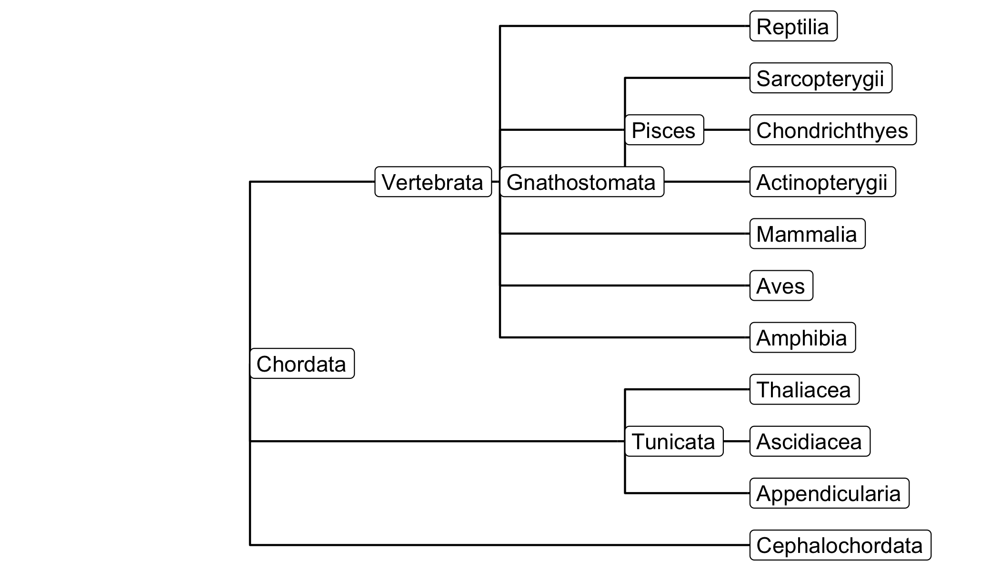
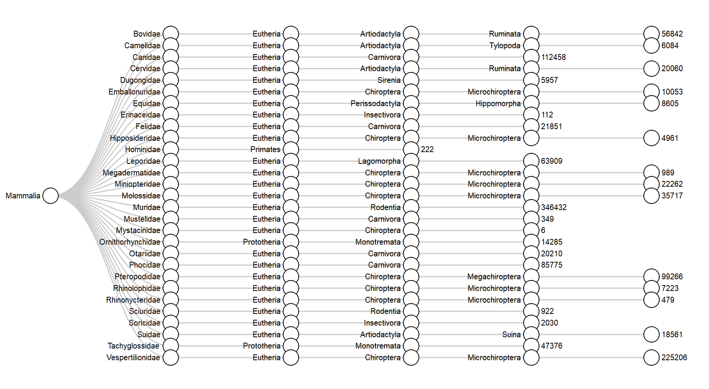

`galah` provides multiple ways of retrieving taxonomic information, and the best
method depends of the type of information required. Below, some use cases are
outlined. 

## Searching for a single species or clade

The simplest way to get taxonomic information is to use `select_taxa`. This function
takes one or more scientific names and checks them against the ALA's taxonomy 
service.

```r
library(galah)
select_taxa("Chordata")
```

```
##   search_term scientific_name                                                            taxon_concept_id   rank match_type  kingdom   phylum vernacular_name  issues
## 1    Chordata        CHORDATA urn:lsid:biodiversity.org.au:afd.taxon:065f1da4-53cd-40b8-a396-80fa5c74dedd phylum exactMatch Animalia Chordata     vertebrates noIssue
```

By default, this function shows the search term, the match (if any) within the ALA,
and some information on higher taxonomy of that clade. Critically, it also
returns a unique identifier for that clade, stored in the column 
`taxon_concept_id`. This identifer is the information that the ALA needs to 
return data that is specific to the taxon in question, i.e.:

```r
ala_counts(taxa = select_taxa("Chordata"))
```

```
## [1] 68909129
```

`select_taxa` can accept a vector or a `data.frame` of taxonomic names,
and always returns a `data.frame` with the same number of rows as there are 
names to query. 

One final, useful feature of `select_taxa` is that it works in reverse. That is,
if you have a unique identifier and would like to know which taxon it refers to,
you can find that out by setting `is_id` to `TRUE`:


```r
select_taxa("urn:lsid:biodiversity.org.au:afd.taxon:97764bed-9492-4066-a45f-e5b0c6c4280d", is_id = TRUE)
```

## Searching for lists of species
A common use case for atlas data is to identify the list of species that 
occur within a clade, in a particular location, or according to
some other criterion. This is provided by the `ala_species` function.


```r
burrowing_frogs <- ala_species(
  taxa = select_taxa("Heleioporus"))
str(burrowing_frogs, give.attr = FALSE)
```

```
## 'data.frame':	6 obs. of  10 variables:
##  $ kingdom        : chr  "Animalia" "Animalia" "Animalia" "Animalia" ...
##  $ phylum         : chr  "Chordata" "Chordata" "Chordata" "Chordata" ...
##  $ class          : chr  "Amphibia" "Amphibia" "Amphibia" "Amphibia" ...
##  $ order          : chr  "Anura" "Anura" "Anura" "Anura" ...
##  $ family         : chr  "Limnodynastidae" "Limnodynastidae" "Limnodynastidae" "Limnodynastidae" ...
##  $ genus          : chr  "Heleioporus" "Heleioporus" "Heleioporus" "Heleioporus" ...
##  $ species        : chr  "Heleioporus eyrei" "Heleioporus australiacus" "Heleioporus albopunctatus" "Heleioporus psammophilus" ...
##  $ author         : chr  "(Gray, 1845)" "(Shaw & Nodder, 1795)" "Gray, 1841" "(Lee & Main, 1954)" ...
##  $ species_guid   : chr  "urn:lsid:biodiversity.org.au:afd.taxon:cf991494-ccee-433d-b049-f2a0996a0a3b" "urn:lsid:biodiversity.org.au:afd.taxon:20119b25-a27c-4174-b3e0-8639e8a21131" "urn:lsid:biodiversity.org.au:afd.taxon:c1d18a1e-5aec-4441-aa3c-e0ac799f51e8" "urn:lsid:biodiversity.org.au:afd.taxon:0efbf288-1526-4551-af83-52e4fb9dae59" ...
##  $ vernacular_name: chr  "Moaning Frog" "Giant Burrowing Frog" "Western Spotted Frog" "Sand Frog" ...
```
`ala_species` is similar to `select_taxa`, in that it returns taxonomic information
and unique identifiers in a `data.frame`. It differs in not being able to return 
information on taxonomic levels other than the species; but also in being more flexible 
by supporting filtering e.g.:


```r
burrowing_frogs <- ala_species(
  taxa = select_taxa("Heleioporus"),
  filters = select_filters(
    stateProvince = "New South Wales", 
    year > 2010))
str(burrowing_frogs, give.attr = FALSE)
```

```
## 'data.frame':	4 obs. of  10 variables:
##  $ kingdom        : chr  "Animalia" "Animalia" "Animalia" "Animalia"
##  $ phylum         : chr  "Chordata" "Chordata" "Chordata" "Chordata"
##  $ class          : chr  "Amphibia" "Amphibia" "Amphibia" "Amphibia"
##  $ order          : chr  "Anura" "Anura" "Anura" "Anura"
##  $ family         : chr  "Limnodynastidae" "Limnodynastidae" "Limnodynastidae" "Limnodynastidae"
##  $ genus          : chr  "Heleioporus" "Heleioporus" "Heleioporus" "Heleioporus"
##  $ species        : chr  "Heleioporus australiacus" "Heleioporus inornatus" "Heleioporus eyrei" "Heleioporus barycragus"
##  $ author         : chr  "(Shaw & Nodder, 1795)" "(Lee & Main, 1954)" "(Gray, 1845)" "Lee, 1967"
##  $ species_guid   : chr  "urn:lsid:biodiversity.org.au:afd.taxon:20119b25-a27c-4174-b3e0-8639e8a21131" "urn:lsid:biodiversity.org.au:afd.taxon:16fcc761-685a-4527-b5e4-e6c7042ae2c6" "urn:lsid:biodiversity.org.au:afd.taxon:cf991494-ccee-433d-b049-f2a0996a0a3b" "urn:lsid:biodiversity.org.au:afd.taxon:c527388c-1cc7-4a10-800a-243b5a2dcd3c"
##  $ vernacular_name: chr  "Giant Burrowing Frog" "Plains Frog" "Moaning Frog" "Western Marsh Frog"
```

## Advanced taxonomic queries
Although we have focussed above on functions that are built to integrate
taxonomic concepts, the more general `select_filters` can be used to 
build more flexible queries using the `taxonConceptID` field.
This can be useful for paraphyletic concepts such as invertebrates:


```r
invertebrate_filter <- select_filters(
   taxonConceptID = select_taxa("Animalia")$taxon_concept_id,
   taxonConceptID != select_taxa("Chordata")$taxon_concept_id)
head(ala_counts(filters = invertebrate_filter, group_by = "class"))
```

```
##          class   count
## 1      Insecta 3120780
## 2   Gastropoda  824225
## 3 Malacostraca  508120
## 4    Arachnida  494441
## 5  Maxillopoda  462423
## 6   Polychaeta  256523
```

## Taxonomic trees

While many users want to restrict searches to particular taxa using `select_taxa()`,
there are many cases where the taxonoimc hierarchy is itself the parameter of 
investigation. In that case you can return taxonomic information as a tree
(from package `data.tree`) using `ala_taxonomy()`. This function requires 
two arguments:
  
  - `taxa` supplies the higher taxonomic group for which data is required
  - `down_to` is the lowest rank of the taxonomic hierarchy that the user requires (see `find_ranks()` for valid options)

The function then searches 'downwards' from `taxa` to build the tree.


```r
library(data.tree)
classes <- ala_taxonomy(taxa = select_taxa("Chordata"), down_to = "class")
print(classes, "rank")
```

```
##                             levelName       rank
## 1  Chordata                               phylum
## 2   ¦--Cephalochordata                 subphylum
## 3   ¦   °--Amphioxi                        class
## 4   ¦--Craniata                        subphylum
## 5   ¦   °--Agnatha                    superclass
## 6   ¦       ¦--Cephalasipidomorphi         class
## 7   ¦       °--Myxini                      class
## 8   ¦--Tunicata                        subphylum
## 9   ¦   ¦--Appendicularia                  class
## 10  ¦   ¦--Ascidiacea                      class
## 11  ¦   °--Thaliacea                       class
## 12  °--Vertebrata                      subphylum
## 13      °--Gnathostomata                informal
## 14          ¦--Amphibia                    class
## 15          ¦--Aves                        class
## 16          ¦--Mammalia                    class
## 17          ¦--Pisces                   informal
## 18          ¦   ¦--Actinopterygii          class
## 19          ¦   ¦--Chondrichthyes          class
## 20          ¦   ¦--Cephalaspidomorphi      class
## 21          ¦   °--Sarcopterygii           class
## 22          °--Reptilia                    class
```


Note that if you are traversing more than 3 ranks, it might be more efficient
to use `ala_species`, as `search_taxonomy` is inefficient when the search tree
is large.

### Manipulating trees

The `data.tree` package is quite rich and contains many useful functions, so we
won't attempt to give a complete overview here. Nonetheless, there are some useful
functions that might be of particular interest. A clear example is 'pruning' the tree,
for example by only retaining nodes that are from the same source (or 'authority').


```r
unique(classes$Get("authority")) # levels available in the dataset
```

```
## [1] "AFD"  "NZOR" "CAAB"
```

```r
# subset to only those nodes supplied by the Australian Faunal Directory
Prune(classes, pruneFun = function(a){a$authority == "AFD"})
```

```
## [1] 6
```

```r
print(classes, "authority")
```

```
##                         levelName authority
## 1  Chordata                             AFD
## 2   ¦--Cephalochordata                  AFD
## 3   ¦--Tunicata                         AFD
## 4   ¦   ¦--Appendicularia               AFD
## 5   ¦   ¦--Ascidiacea                   AFD
## 6   ¦   °--Thaliacea                    AFD
## 7   °--Vertebrata                       AFD
## 8       °--Gnathostomata                AFD
## 9           ¦--Amphibia                 AFD
## 10          ¦--Aves                     AFD
## 11          ¦--Mammalia                 AFD
## 12          ¦--Pisces                   AFD
## 13          ¦   ¦--Actinopterygii       AFD
## 14          ¦   ¦--Chondrichthyes       AFD
## 15          ¦   °--Sarcopterygii        AFD
## 16          °--Reptilia                 AFD
```

Note that the above syntax is slightly unusual, in that the tree 
(`classes`) is updated even though we don't assign the result to an obect. 
This is because `classes` is an `S6` object. In fact, trees created from 
`data.tree` Nodes have a few unusual properties that we can exploit to do 
interesting things. A common task, for example, is to calculate the number of 
records present for each node in the tree. A quick way to do this would be to 
extract all the `guid` values and query them using `ala_counts()`.
  

```r
counts <- lapply(classes$Get("guid"), ala_counts)
```

While this approach works, it is inefficient, because each node has to be searched
separately. A more efficient solution is to recognise that counts for higher 
taxonomic groups/nodes should be the sum of their child nodes. We can use this 
logic to run fewer queries via the ALA, and thereby get a neater result in less time.


```r
# select only the 'leaves' (terminal nodes) of the tree
leaves <- Traverse(classes, filterFun = isLeaf)

# get data on record counts
leaf_counts <- lapply(Get(leaves, "guid"), ala_counts)

# add back on to the tree
classes$Set(n_records = 0)
Set(leaves, n_records = unlist(leaf_counts))
print(classes, "n_records")
```

```
##                         levelName n_records
## 1  Chordata                               0
## 2   ¦--Cephalochordata                  564
## 3   ¦--Tunicata                           0
## 4   ¦   ¦--Appendicularia             74591
## 5   ¦   ¦--Ascidiacea                 24267
## 6   ¦   °--Thaliacea                   9458
## 7   °--Vertebrata                         0
## 8       °--Gnathostomata                  0
## 9           ¦--Amphibia              814058
## 10          ¦--Aves                59712719
## 11          ¦--Mammalia             3195438
## 12          ¦--Pisces                     0
## 13          ¦   ¦--Actinopterygii   2915369
## 14          ¦   ¦--Chondrichthyes    841450
## 15          ¦   °--Sarcopterygii       4353
## 16          °--Reptilia             1296302
```

```r
# sum upwards
classes$Do(
  function(a){
    a$n_records <- Aggregate(node = a, attribute = "n_records", aggFun = sum)},
  traversal = "post-order")
print(classes, "n_records")
```

```
##                         levelName n_records
## 1  Chordata                        68888569
## 2   ¦--Cephalochordata                  564
## 3   ¦--Tunicata                      108316
## 4   ¦   ¦--Appendicularia             74591
## 5   ¦   ¦--Ascidiacea                 24267
## 6   ¦   °--Thaliacea                   9458
## 7   °--Vertebrata                  68779689
## 8       °--Gnathostomata           68779689
## 9           ¦--Amphibia              814058
## 10          ¦--Aves                59712719
## 11          ¦--Mammalia             3195438
## 12          ¦--Pisces               3761172
## 13          ¦   ¦--Actinopterygii   2915369
## 14          ¦   ¦--Chondrichthyes    841450
## 15          ¦   °--Sarcopterygii       4353
## 16          °--Reptilia             1296302
```

The same approach can be used to find the number of species within a clade

```r
# get species counts
leaf_spp_counts <- lapply(
  Get(leaves, "guid"),
  function(x){ala_counts(x, type = "species")})

# add back to the tree, then sum
classes$Set(n_species = 0)
Set(leaves, n_species = unlist(leaf_spp_counts))
classes$Do(
  function(a){
    a$n_species <- Aggregate(node = a, attribute = "n_species", aggFun = sum)},
  traversal = "post-order")
  
# check results
print(classes, "n_species")
```

```
##                         levelName n_species
## 1  Chordata                            9174
## 2   ¦--Cephalochordata                    7
## 3   ¦--Tunicata                         809
## 4   ¦   ¦--Appendicularia                10
## 5   ¦   ¦--Ascidiacea                   784
## 6   ¦   °--Thaliacea                     15
## 7   °--Vertebrata                      8358
## 8       °--Gnathostomata               8358
## 9           ¦--Amphibia                 245
## 10          ¦--Aves                     952
## 11          ¦--Mammalia                 421
## 12          ¦--Pisces                  5649
## 13          ¦   ¦--Actinopterygii      5292
## 14          ¦   ¦--Chondrichthyes       356
## 15          ¦   °--Sarcopterygii          1
## 16          °--Reptilia                1091
```

### Conversion

Although the tree format is useful, converting to a `data.frame` 
is straightforward.


```r
# arrange columns by 'level'
ToDataFrameTypeCol(classes) 
```

```
##     level_1         level_2        level_3  level_4        level_5
## 1  Chordata Cephalochordata           <NA>     <NA>           <NA>
## 2  Chordata        Tunicata Appendicularia     <NA>           <NA>
## 3  Chordata        Tunicata     Ascidiacea     <NA>           <NA>
## 4  Chordata        Tunicata      Thaliacea     <NA>           <NA>
## 5  Chordata      Vertebrata  Gnathostomata Amphibia           <NA>
## 6  Chordata      Vertebrata  Gnathostomata     Aves           <NA>
## 7  Chordata      Vertebrata  Gnathostomata Mammalia           <NA>
## 8  Chordata      Vertebrata  Gnathostomata   Pisces Actinopterygii
## 9  Chordata      Vertebrata  Gnathostomata   Pisces Chondrichthyes
## 10 Chordata      Vertebrata  Gnathostomata   Pisces  Sarcopterygii
## 11 Chordata      Vertebrata  Gnathostomata Reptilia           <NA>
```

```r
# arrange columns by 'rank'
ToDataFrameTypeCol(classes, type = "rank") # works, but merges informal ranks
```

```
##    rank_phylum  rank_subphylum         rank_informal     rank_class
## 1     Chordata Cephalochordata                  <NA>           <NA>
## 2     Chordata        Tunicata                  <NA> Appendicularia
## 3     Chordata        Tunicata                  <NA>     Ascidiacea
## 4     Chordata        Tunicata                  <NA>      Thaliacea
## 5     Chordata      Vertebrata         Gnathostomata       Amphibia
## 6     Chordata      Vertebrata         Gnathostomata           Aves
## 7     Chordata      Vertebrata         Gnathostomata       Mammalia
## 8     Chordata      Vertebrata Pisces, Gnathostomata Actinopterygii
## 9     Chordata      Vertebrata Pisces, Gnathostomata Chondrichthyes
## 10    Chordata      Vertebrata Pisces, Gnathostomata  Sarcopterygii
## 11    Chordata      Vertebrata         Gnathostomata       Reptilia
```

While useful, neither of the above approaches preserve the rank of each node if
there are multiple nodes in the `data.tree` returned with rank `informal` or 
`unranked`. Therefore, a more useful approach is to take more care in linking 
levels and ranks, then converting to a `data.frame`


```r
# create a label that uniquely identifies unranked nodes
classes$Do(
  function(a){
    if(a$rank %in% find_ranks()$name){
      a$rank_level <- a$rank
    }else{
      a$rank_level <- paste0(a$rank, "-level-", a$level)
    }
  })

# use rank_level as an index to create a data.frame
df <- ToDataFrameTypeCol(classes, type = "rank_level", prefix = NULL)
df
```

```
##      phylum       subphylum informal-level-3 informal-level-4          class
## 1  Chordata Cephalochordata             <NA>             <NA>           <NA>
## 2  Chordata        Tunicata             <NA>             <NA> Appendicularia
## 3  Chordata        Tunicata             <NA>             <NA>     Ascidiacea
## 4  Chordata        Tunicata             <NA>             <NA>      Thaliacea
## 5  Chordata      Vertebrata    Gnathostomata             <NA>       Amphibia
## 6  Chordata      Vertebrata    Gnathostomata             <NA>           Aves
## 7  Chordata      Vertebrata    Gnathostomata             <NA>       Mammalia
## 8  Chordata      Vertebrata    Gnathostomata           Pisces Actinopterygii
## 9  Chordata      Vertebrata    Gnathostomata           Pisces Chondrichthyes
## 10 Chordata      Vertebrata    Gnathostomata           Pisces  Sarcopterygii
## 11 Chordata      Vertebrata    Gnathostomata             <NA>       Reptilia
```

If we want to take more information out of the tree, we can extract it 
and append to our new `data.frame`.


```r
cbind(
  df[, c("phylum", "subphylum", "class")],
  data.frame(
    auth = ToDataFrameTypeCol(classes, "authority")$authority))
```

```
##      phylum       subphylum          class auth
## 1  Chordata Cephalochordata           <NA>  AFD
## 2  Chordata        Tunicata Appendicularia  AFD
## 3  Chordata        Tunicata     Ascidiacea  AFD
## 4  Chordata        Tunicata      Thaliacea  AFD
## 5  Chordata      Vertebrata       Amphibia  AFD
## 6  Chordata      Vertebrata           Aves  AFD
## 7  Chordata      Vertebrata       Mammalia  AFD
## 8  Chordata      Vertebrata Actinopterygii  AFD
## 9  Chordata      Vertebrata Chondrichthyes  AFD
## 10 Chordata      Vertebrata  Sarcopterygii  AFD
## 11 Chordata      Vertebrata       Reptilia  AFD
```

###  Visualisation

There are a range of methods for visualising objects returned by `data.tree`. 
The `tidygraph` package can be used to convert a tree into a format suitable for 
plotting with `ggraph`.


```r
library(ggplot2)
library(tidygraph)
library(ggraph)

ggraph(as_tbl_graph(classes), layout = 'dendrogram') +
  geom_edge_elbow() + 
  geom_node_label(aes(label = name), hjust = 0) +
  coord_flip() +
  scale_y_reverse(expand = expansion(add = 2)) +
  theme_void() 
```


Alternatively, the `collapsibleTree` package works on a `data.frame`.


```r
library(collapsibleTree)
collapsibleTree(
  df,
  hierarchy = colnames(df),
  root = "Chordata",
  collapsed = FALSE,
  width = 700,
  height = 400)
```
<!-- A static image of the plot to avoid CRAN phantomjs() conflicts -->

